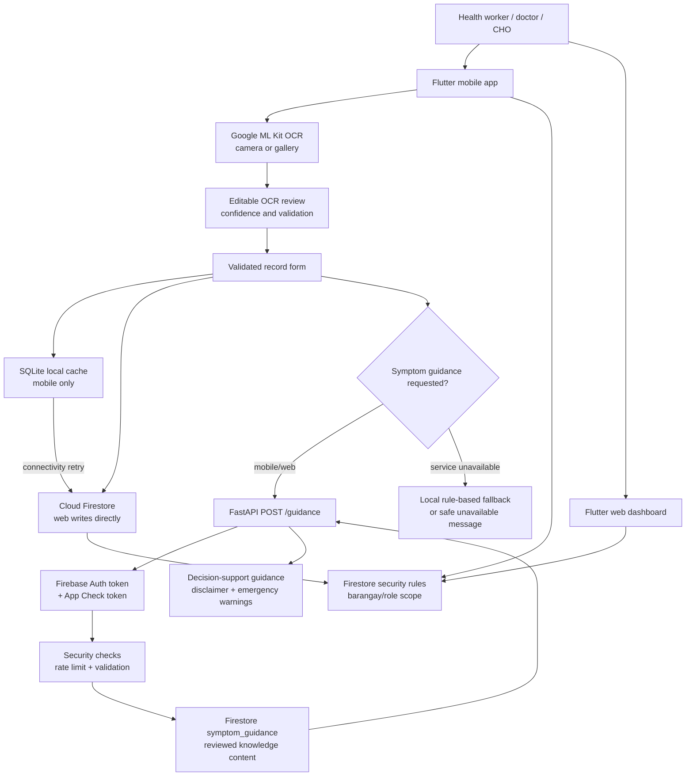

# System architecture

AI-DSUHIS is a Flutter application with separate mobile and web presentation
trees, shared domain utilities, Firebase persistence/security, and an optional
FastAPI symptom-guidance service.

## Responsibilities

| Layer | Responsibility | Source locations |
| --- | --- | --- |
| Flutter mobile | Offline-first record entry, local classifier fallback, OCR capture/review | `lib/app` |
| Flutter web | Role-specific BHW, doctor, and CHO workflows; direct Firestore access | `lib/web` |
| Shared client code | Branding, scope normalization, privacy copy, record utilities | `lib/shared` |
| Local persistence | SQLite records with a `synced` flag and connectivity retry | `lib/app/features/*/*_database_helper.dart` |
| Firebase | Authentication, Firestore, App Check, Hosting, security rules | `lib/main.dart`, `firestore.rules` |
| Guidance backend | Authenticated, rate-limited, recognition-only guidance aggregation | `backend/app` |
| Offline model artifact | Evaluation/documentation only; the disabled `/predict` route does not expose it | `backend/models`, `backend/app/api.py` |

## Record and guidance boundaries

1. OCR only assists data entry. The worker reviews extracted values and the
   normal form validation still controls saving.
2. A mobile record is written locally before a remote guidance request can
   block it. If guidance is unavailable, the record remains usable and the
   user sees an explicit status/message.
3. `/guidance` returns supportive, emergency-referral, and human-review
   content. It does not return a disease diagnosis or prescription.
4. The local classifier is an offline routing/decision-support fallback. It
   is not clinical validation and must not be described as a diagnostic model.
5. Firestore rules enforce authentication, approval, role, and barangay scope;
   the emulator-backed permission evidence is recorded in
   `docs/E2E_TEST_LOG.md`.
